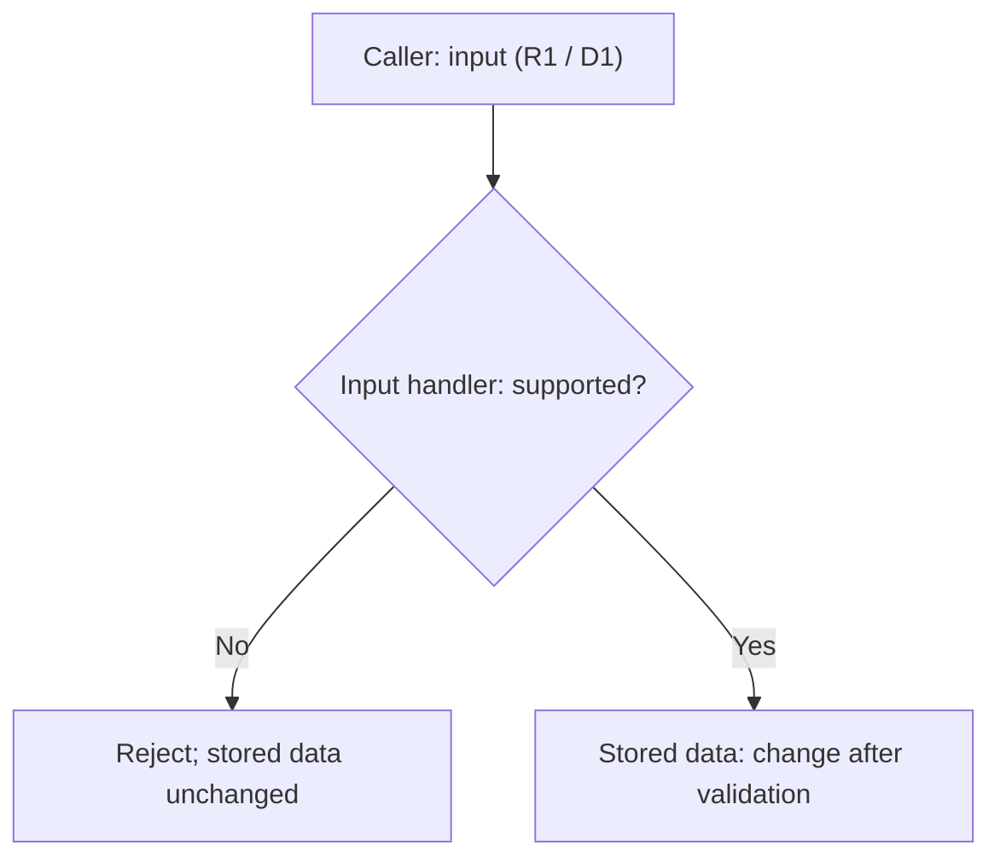

# Operating examples

Read only the relevant situation. Concrete commands and decisive raw execution evidence belong in the project's agreed task ticket; the cycle summary links canonical decisions, ticket versions/status and main's assessment.

## Preparation

A recipe expects a result field: inspect the current interface's definition/use and that field's meaning before treating it as proof. Confirm only assumptions, tools, and verification means relevant to this check; past success does not prove compatibility. Correct an invocation within existing authority; contract changes or a weaker expected result need a decision. Missing means leaves affected verification unverified while independent work continues.

Reuse the project's existing recipes and available tools after confirming their applicability to the current target/interface/environment; keep concrete commands in that project's task ticket rather than make them common skill commands. A preparation error grants no new collector, helper, dependency, or environment change. Link the check plan/stop policy through packet `acceptance`, contracts and execution through `deps`/`evidence`. Prepared commands are not executed checks.

## Current state

Use the summary and task tickets as a lightweight shared work board: read the complete assigned ten-field packet in your ticket and relevant summary spec/approval/decisions, owner/status, blocker, handoff and evidence pointers. Assignment messages link that exact packet/version and deltas. Within the same agent/work, reuse previously fully read instructions while their applicable version, rights, and context remain current and available; changes or unavailable context require affected rereads, and original/higher-priority mandatory reads and handoffs take precedence. Update at meaningful checkpoints, blockers or handoffs, not every message or full transcript. Main writes the summary; each ticket has one exact writer, with concurrent writes only to different files. Main confirms previous write/related execution STOP before changing a ticket writer/packet; no implicit locks or automatic work claiming.

If a ticket references an old spec, its writer reads current ownership/version and updates affected sections against the summary's approved spec/decisions and observed executor mapping. Keep task checkpoint/fixed target/raw receipts in that ticket, not a copied whole spec/report/history. Retain exact rights, unresolved gates, accumulated failures, retry/STOP/restart constraints and decisive contrary/QA evidence across tickets/executors/routes. Existing safe evidence/logs may be referenced; external history stays untouched. Links grant no authority. Authored, checked, independently reviewed, main-assessed and human-accepted states remain distinct; stable completion follows SKILL's user-review and agreed literal summary/ticket cleanup gates.

Worker sends its frozen artifact/ticket version and raw evidence/limits directly to main's already assigned different reviewer. Reviewer writes its own ticket and returns ordinary corrections within existing approved behavior/API, acceptance, write/action and retry rights without new user approval. Main receives compact ticket/version/status/evidence pointers; scope/acceptance/authority changes, ownership conflicts, actual blockers, STOP/resumption and final judgment stay with main and the applicable decision-maker. Inspect role-exposed messaging tools; claim support only with an observed scoped delivery receipt to the assigned recipient. Otherwise state unsupported/unverified routing and the existing main pointer-notification fallback. Reading a shared ticket does not establish automatic delivery; no new service, queue, helper, polling or efficiency assertion.

### Collaboration trace and methods

Illustrative local labels: approved `R1` rejects unsupported input before stored data changes; `D1` chooses validation before mutation over rollback complexity. This premise is neither a new product requirement nor a test result.

The summary's spec/decision links `R1`/`D1` to the worker's complete ticket, role/executor, allowed files and check plan. The frozen ticket might hold raw receipts for rejection **passed**, supported-input regression **failed**, and required CI **unverified/not run**. Worker notifies the assigned reviewer with the exact ticket/version/target/evidence pointer through an observed available route, or records main pointer fallback if unavailable. A different reviewer independently reads that frozen evidence and records its assessment in its own ticket, without author self-assessment or other reviewer conclusions. An ordinary correction within existing rights needs no fresh user approval; a reached STOP or undefined retry holds the affected work for main. A frozen review checkpoint does not cancel assignment-end/limit STOP: corrections require a still-valid worker assignment/rights/retry allowance, or main's updated complete packet and resumption authority, never a peer message alone. Main compares linked evidence with `R1`; failed/unrun gates remain unresolved. These are illustrative statuses, not executed checks.

### Specification diagram example

Select complementary views, not two names for the same diagram: overview for components/responsibilities/flow; UML-style class, sequence, or state view for the relevant design question. Keep both with the same canonical Markdown spec/version and consistent identifiers/relationships. Update affected views on meaningful spec/design changes. Honor original instructions and user format/no-diagram preferences. Explain an omitted redundant view, or missing information that prevents a grounded design view; never invent APIs, types, interactions, or approval to fill it.

The pair below shares illustrative `example-v1`, `R1`, and `D1` above. Its approval premise and architecture are examples only. The overview shows which branch permits mutation; the sequence adds responsibility boundaries and order.



```mermaid
sequenceDiagram
    participant Caller
    participant Handler as Input handler
    participant Store as Stored data
    Caller->>Handler: Submit input (R1 / D1)
    Note over Handler: Validate before mutation (D1)
    alt Unsupported input
        Handler-->>Caller: Reject input (R1)
        Note over Store: Unchanged; no mutation requested
    else Supported input
        Handler->>Store: Change stored data
    end
```

Diagrams complement Markdown requirements, constraints, acceptance, and decisions; they do not replace them or authorize implementation. Preserve proposed/unknown/approved status in text and views; unresolved questions stay in Markdown.

Source authoring, parser validation, display rendering, semantic review, formal conformance, and runtime/model behavior are distinct evidence scopes. Mermaid alone establishes no normative UML conformance. Preserve fenced source and a brief explanation; mark unperformed parser/display checks unverified. Claim only checks run on the fixed version. Authoring/static checks prove no implementation/model behavior or efficiency gain; install no tools merely for paired views.

## Bounded evidence

A lookup finds the wrong path or absent field: simplify, discover the actual source, then inspect its relevant section/field. Cite safe fixed identifiers and locations, preserving decisive conditions and contrary evidence. A short excerpt missing a decisive condition is insufficient. Use project conventions, without imposing common syntax or output caps.

### Project quality checks

Agree applicable tools/versions/configuration, scope/baseline, thresholds, blocking conditions, and justified exceptions in the existing spec/decisions and `acceptance`. Reuse local/CI/static checks as appropriate; no universal tool or schedule. Commands, credentials, services, and logs stay project-local; do not collect secrets.

For the fixed source/build/configuration given to review, record executed commands and passed/failed/unverified-not-run outcomes in the implementation ticket, including preparation/partial failures under the approved stop policy; send main an evidence pointer. A different reviewer may reuse actual receipts for that same fixed target/environment/acceptance while independently judging the changes. Refresh affected checks when source/configuration/environment or acceptance changes invalidate receipts, proof is missing or contradictory, or an original mandatory gate requires fresh execution; unclear applicability remains unverified. Distinguish a completed CI scan from its quality gate. Required unavailable CI remains unverified; a CI link or prepared command is not execution, and spec approval supplies no separate setup/push/merge authority.

For a separately authorized deployment, one complete packet can cover commit, push, remote readback, installation, and checks within its exact rights and required review/ownership gates. Keep the sequence, results, and remaining controls in that assignment's evidence; a command boundary alone needs no new packet. Return the fixed target, actual results, unverified controls/limits, and write/execution STOP once at assignment completion; main need not reopen it for another completion acknowledgment. Report real blockers when observed. This example grants no deployment authority and bypasses no review, failure, or STOP gate.

Use the agreed baseline for previous versus introduced/affected issues. Retain existing defects that undermine approved behavior; unclear origin/impact stays explicit. Scores/coverage/lint alone prove neither correctness nor acceptance/permission. Do not weaken checks, suppress findings, or hide threshold/exception/environment/authority changes in results; apply the project decision policy.

When comparing original code and a test variant, confirm **before comparison** both actual source paths and revisions/identifiers, build settings, and which source/build produced each executable/artifact. Record safe references. If shared caches/intermediates could mix sources/settings, use separate build directories within the approved write set. Unconfirmed provenance or necessary separation limits the comparison; do not call it a confirmed pass. This requires no blanket directory split and authorizes no shared-cache deletion, global environment changes, or added tools; independent work may continue.

### Human manual QA handoff

For approved user verification, use QA → reviewer → main → user → QA → reviewer → main. QA is the existing instruction-preparation/evidence-judgment responsibility. Use observed role/executor mappings; reviewers differ from the QA artifact's author and implementer, without requiring a new reviewer each phase.

Before release, QA maps every approved criterion, including combined criteria, to the **complete instruction delivery unit**, expected result, approved requested evidence, and anticipated fixed target. Tables, surrounding prose, cautions, and conditions all belong to that unit. Reviewer checks omissions, ambiguity, and requests beyond acceptance; main sends the reviewed instructions.

After replies, main gives QA the complete unit **actually sent** plus related original user replies/attachments. Link criteria/plan in `acceptance`, handoffs/policies in `deps`, and actual instructions, original responses, target, criterion judgments and independent reviewer grounds in the relevant tickets' `evidence`, linked from the summary. Safe accessible original locations or complete relevant passages suffice; summaries only index them, without a separate QA report. Preserve reviewed-versus-sent wording differences and revisit affected criteria. Do not copy whole chats/unrelated history or sensitive material. Inaccessible/redacted evidence preventing judgment leaves affected criteria unverified.

QA confirms the actual target's connection to the anticipated fixed target. Distinguish user reports, facts directly observed in screen/images, measurements with region/source/method/unit, and unverified matters. Evidence sufficiency follows approved criteria/plan, without universal images, exact numbers, or DPI submissions:

- “All done” covers only instructed items as a user report. An omitted combined criterion remains untested; complete its instructions within existing acceptance, without adding criteria.
- Overall image dimensions do not establish app client dimensions without measurement evidence. Do not infer unstated DPI/scale or demand unapproved exact values.

Ambiguous meaning or target linkage remains unverified without lowering acceptance. Reviewer independently judges what evidence supports for that fixed target; main compares approved acceptance. Later replies update directly answered criteria and those affected by instruction changes, contradictions, or target changes. Retain valid evidence; unclear linkage/change impact cannot inherit a pass. Blanket retesting or new user captures are not automatic requirements.

## Failure and resumption

A stage cannot run due to its environment, or runs and finds a defect. Separate cause/category from check status: environment failure alone is not product failure; partial verification leaves remaining gates unverified. The ticket writer retains failed/last completed stage, fixed target, raw evidence, unrun checks, affected work and restart conditions in its current checkpoint; main links the blocker/status in the summary. Report actual blockers immediately and hold affected work; independent work may continue. Replacement or a route change does not clear these controls.

Apply the approved project retry/stop policy, including preparation, partial/interrupted failures, and unrun review. Environmental classification does not automatically exclude a failure from counting. Undefined necessary policy holds only the affected retry for main's decision; no common count/formula applies.

Example: preparation fails before review; a replacement uses another backend/task name. Retain accumulated failures, exact rights, fixed target, failed stage, and unrun review. A different route may address the cause within authority but cannot erase gates or authorize retries beyond policy. Policy/count/scope transitions require decision-maker and approval evidence, not a new packet name or explanation alone.

Missing mandatory proof or reaching STOP cannot become a pass. Refresh affected review after changes. Close when the agreed boundary is met, without filling a calendar period; unresolved required checks prevent completion.
