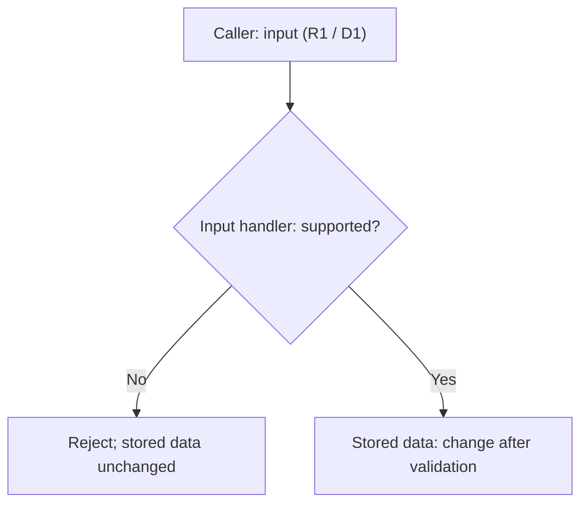

# Operating examples

Read only the relevant situation. Concrete paths, commands, and execution evidence stay in the project's agreed records.

## Preparation

A recipe expects a result field: inspect the current interface's definition/use and that field's meaning before treating it as proof. Confirm only assumptions, tools, and verification means relevant to this check; past success does not prove compatibility. Correct an invocation within existing authority; contract changes or a weaker expected result need a decision. Missing means leaves affected verification unverified while independent work continues.

Reuse existing recipes/native tools; a preparation error grants no new collector, dependency, or environment change. Link the check plan/stop policy through packet `acceptance`, contracts and execution through `deps`/`evidence`. Prepared commands are not executed checks.

## Current state

An index references an old spec. Resolve it against canonical approval/version and update the existing pointer/checkpoint within assigned ownership. Link the current spec, approval, role/executor, checkpoint, and fixed target; identify the pointer's maintainer. Leave raw history/logs at source. Links index evidence and grant no authority; no new index is required. Replacement handoffs use Workflow 2's exact rights, STOP, and retained failure history.

### Collaboration trace and methods

Illustrative local labels: approved `R1` rejects unsupported input before stored data changes; `D1` chooses validation before mutation over rollback complexity. This premise is neither a new product requirement nor a test result.

The existing spec/decision links `R1`/`D1` to the worker's role/executor, allowed files, and check plan. The fixed handoff might show rejection **passed**, supported-input regression **failed**, and required CI **unverified/not run**. Preserve actual commands/outcomes and decisive source evidence. A different reviewer assesses that version; main compares it with `R1`. Failed/unrun required gates remain unresolved. Existing labels and records suffice.

### Specification diagram example

Select complementary views, not two names for the same diagram: overview for components/responsibilities/flow; UML-style class, sequence, or state view for the relevant design question. Keep both with the same canonical Markdown spec/version and consistent identifiers/relationships. Update affected views on meaningful spec/design changes. Honor original instructions and user format/no-diagram preferences. Explain an omitted redundant view, or missing information that prevents a grounded design view; never invent APIs, types, interactions, or approval to fill it.

The pair below shares illustrative `example-v1`, `R1`, and `D1` above. Its approval premise and architecture are examples only. The overview shows which branch permits mutation; the sequence adds responsibility boundaries and order.



```mermaid
sequenceDiagram
    participant Caller
    participant Handler as Input handler
    participant Store as Stored data
    Caller->>Handler: Submit input (R1 / D1)
    Note over Handler: Validate before mutation (D1)
    alt Unsupported input
        Handler-->>Caller: Reject input (R1)
        Note over Store: Unchanged; no mutation requested
    else Supported input
        Handler->>Store: Change stored data
    end
```

Diagrams complement Markdown requirements, constraints, acceptance, and decisions; they do not replace them or authorize implementation. Preserve proposed/unknown/approved status in text and views; unresolved questions stay in Markdown.

Source authoring, parser validation, display rendering, semantic review, formal conformance, and runtime/model behavior are distinct evidence scopes. Mermaid alone establishes no normative UML conformance. Preserve fenced source and a brief explanation; mark unperformed parser/display checks unverified. Claim only checks run on the fixed version. Authoring/static checks prove no implementation/model behavior or efficiency gain; install no tools merely for paired views.

## Bounded evidence

A lookup finds the wrong path or absent field: simplify, discover the actual source, then inspect its relevant section/field. Cite safe fixed identifiers and locations, preserving decisive conditions and contrary evidence. A short excerpt missing a decisive condition is insufficient. Use project conventions, without imposing common syntax or output caps.

### Project quality checks

Agree applicable tools/versions/configuration, scope/baseline, thresholds, blocking conditions, and justified exceptions in the existing spec/decisions and `acceptance`. Reuse local/CI/static checks as appropriate; no universal tool or schedule. Commands, credentials, services, and logs stay project-local; do not collect secrets.

For the fixed source/build/configuration given to review, record executed commands and passed/failed/unverified-not-run outcomes, including preparation/partial failures under the approved stop policy. Distinguish a completed CI scan from its quality gate. Required unavailable CI remains unverified; a CI link or prepared command is not execution, and spec approval supplies no separate setup/push/merge authority.

Use the agreed baseline for previous versus introduced/affected issues. Retain existing defects that undermine approved behavior; unclear origin/impact stays explicit. Scores/coverage/lint alone prove neither correctness nor acceptance/permission. Do not weaken checks, suppress findings, or hide threshold/exception/environment/authority changes in results; apply the project decision policy.

When comparing original code and a test variant, confirm **before comparison** both actual source paths and revisions/identifiers, build settings, and which source/build produced each executable/artifact. Record safe references. If shared caches/intermediates could mix sources/settings, use separate build directories within the approved write set. Unconfirmed provenance or necessary separation limits the comparison; do not call it a confirmed pass. This requires no blanket directory split and authorizes no shared-cache deletion, global environment changes, or added tools; independent work may continue.

### Human manual QA handoff

For approved user verification, use QA → reviewer → main → user → QA → reviewer → main. QA is the existing instruction-preparation/evidence-judgment responsibility. Use observed role/executor mappings; reviewers differ from the QA artifact's author and implementer, without requiring a new reviewer each phase.

Before release, QA maps every approved criterion, including combined criteria, to the **complete instruction delivery unit**, expected result, approved requested evidence, and anticipated fixed target. Tables, surrounding prose, cautions, and conditions all belong to that unit. Reviewer checks omissions, ambiguity, and requests beyond acceptance; main sends the reviewed instructions.

After replies, main gives QA the complete unit **actually sent** plus related original user replies/attachments. Link criteria/plan in `acceptance`, handoffs/policies in `deps`, and actual instructions, original responses, target, criterion judgments, and reviewer grounds in `evidence`. Safe accessible original locations or complete relevant passages suffice; summaries only index them. Preserve reviewed-versus-sent wording differences and revisit affected criteria. Do not copy whole chats/unrelated history or sensitive material. Inaccessible/redacted evidence preventing judgment leaves affected criteria unverified.

QA confirms the actual target's connection to the anticipated fixed target. Distinguish user reports, facts directly observed in screen/images, measurements with region/source/method/unit, and unverified matters. Evidence sufficiency follows approved criteria/plan, without universal images, exact numbers, or DPI submissions:

- “All done” covers only instructed items as a user report. An omitted combined criterion remains untested; complete its instructions within existing acceptance, without adding criteria.
- Overall image dimensions do not establish app client dimensions without measurement evidence. Do not infer unstated DPI/scale or demand unapproved exact values.

Ambiguous meaning or target linkage remains unverified without lowering acceptance. Reviewer independently judges what evidence supports for that fixed target; main compares approved acceptance. Later replies update directly answered criteria and those affected by instruction changes, contradictions, or target changes. Retain valid evidence; unclear linkage/change impact cannot inherit a pass. Blanket retesting or new user captures are not automatic requirements.

## Failure and resumption

A stage cannot run due to its environment, or runs and finds a defect. Separate cause/category from check status: environment failure alone is not product failure; partial verification leaves remaining gates unverified. In the existing checkpoint, record failed/last completed stage, fixed target, evidence, unrun checks, affected work, and restart conditions.

Apply the approved project retry/stop policy, including preparation, partial/interrupted failures, and unrun review. Environmental classification does not automatically exclude a failure from counting. Undefined necessary policy holds only the affected retry for main's decision; no common count/formula applies.

Example: preparation fails before review; a replacement uses another backend/task name. Retain accumulated failures, exact rights, fixed target, failed stage, and unrun review. A different route may address the cause within authority but cannot erase gates or authorize retries beyond policy. Policy/count/scope transitions require decision-maker and approval evidence, not a new packet name or explanation alone.

Missing mandatory proof or reaching STOP cannot become a pass. Refresh affected review after changes. Close when the agreed boundary is met, without filling a calendar period; unresolved required checks prevent completion.
