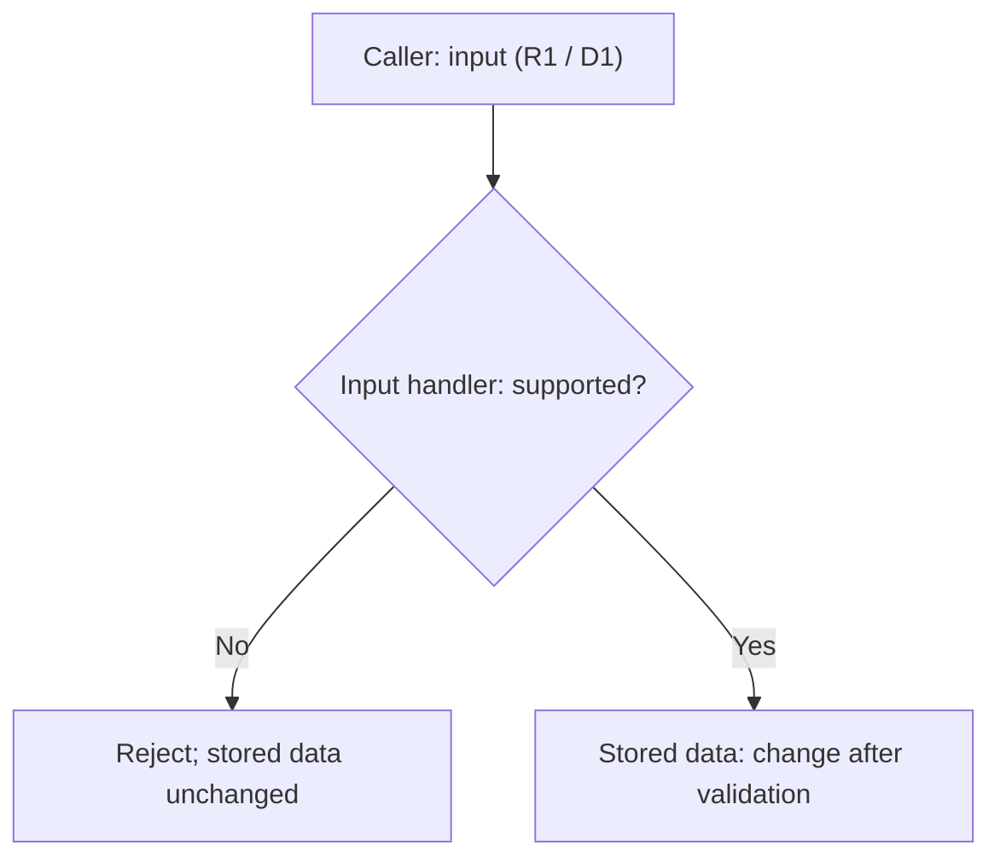

# Operating examples

Read only the relevant situation. Read the approved specification, code/diff and decisive execution evidence directly in their existing sources. Main relays compact assignment/version, fixed-target, status and proof pointers. Standalone operations documents are used only when explicitly requested by the user or required by original project instructions; the examples do not require their creation or cleanup for completion.

Role labels here describe responsibilities, not fixed agent names, specialist roles, a pair/headcount, models or preinstalled custom agents. The project chooses actual configuration/topology within its original instructions and tool/authority restrictions. Assign implementation and review by a different executor before implementation, preserving main's coordination/evidence comparison/report and no implementation fallback. Examples grant no agent creation/redelegation or configuration authority; spawning alone proves no custom role loading.

## Preparation

A recipe expects a result field: inspect the current interface's definition/use and that field's meaning before treating it as proof. Confirm only assumptions, tools, and verification means relevant to this check; past success does not prove compatibility. Correct an invocation within existing authority; contract changes or a weaker expected result need a decision. Missing means leaves affected verification unverified while independent work continues.

Reuse the project's existing recipes and available tools after confirming applicability to the current target/interface/environment; keep concrete commands in existing project evidence rather than make them common skill commands. A preparation error grants no new collector, helper, dependency or environment change. The short assignment links success criteria/checks, dependencies and the applicable approval/failure/retry/STOP state. Acquire original commands, arguments and tool responses when executed, without duplicate logs. Prepared commands are not executed checks; missing raw proof cannot be retrospectively reconstructed as an actual execution receipt.

## Current state

Read the current short assignment, approved spec/decisions, ownership/version, blockers and relevant fixed-target/evidence/failure/STOP state in existing sources. Within the same agent/work, reuse previously fully read instructions while their version, rights and context remain current and available; changes or unavailable context require affected rereads. Original/higher-priority mandatory reads and handoffs take precedence. At meaningful handoffs/blockers, return current results, evidence/limits, unresolved matters and next action in the existing exchange rather than a new checkpoint/log file or full transcript.

If an assignment points to an old spec, check current authority/ownership/version against actual approval before proceeding. Retain exact rights, unresolved gates, accumulated failures, retry/STOP/restart constraints and decisive contrary/QA evidence across assignments/executors/routes. Existing safe evidence/logs may be referenced; historical records stay untouched. Missing evidence or resumption state remains unverified, without resetting counts/state. Links grant no authority. Authored, checked, independently reviewed, main-assessed and human-accepted states remain distinct; document creation/cleanup is not a completion gate.

Only if the user requests or original project instructions require a summary/tickets, agree their literal project-local paths, purpose, writers and rights. One possible arrangement is a main-written summary linking existing approval/evidence and separately owned worker/reviewer tickets; it is not a default or a ten-field requirement. Read latest version/ownership before replacing sections. Main confirms prior write/related execution STOP before overlapping writer handoff, including its initial preparation. Protect unrelated same-name files; no unapproved overwrite, external-root fallback, implicit locks or automatic claiming. Any requested/required cleanup follows scoped authority, explicit completed-target acceptance and SKILL's path/failure/STOP protections; neither creation nor cleanup determines completion.

Worker sends its frozen artifact/assignment version and raw evidence/limits directly to main's already assigned different reviewer. Reviewer returns independent findings and ordinary corrections within existing approved behavior/API, acceptance, write/action and retry rights without new user approval. Main receives compact target/status/evidence pointers, not long code/JSON/encoded content; participants read original sources directly. Scope/acceptance/authority changes, ownership conflicts, actual blockers, STOP/resumption and final judgment stay with main and the applicable decision-maker. Inspect role-exposed messaging tools; claim support only with an observed scoped delivery receipt to the assigned recipient. Otherwise state unsupported/unverified routing and existing main pointer fallback. Reading shared sources does not establish automatic delivery; no new service, queue, helper, polling or efficiency assertion.

### Collaboration trace and methods

Illustrative local labels: approved `R1` rejects unsupported input before stored data changes; `D1` chooses validation before mutation over rollback complexity. This premise is neither a new product requirement nor a test result.

The existing approved spec/decision source links `R1`/`D1` to a short worker assignment's goal, owner, allowed files/actions, success criteria and relevant dependencies/controls. Actual execution responses might establish rejection **passed**, supported-input regression **failed**, and required CI **unverified/not run**. Worker sends the frozen target/assignment version and original evidence pointers to the assigned reviewer through an observed available route, or uses main pointer fallback if unavailable. A different reviewer reads code and raw evidence directly and returns its independent assessment without author self-assessment or other reviewer conclusions. An ordinary correction within existing rights needs no fresh user approval; a reached STOP or undefined retry holds affected work for main. A frozen review target does not cancel assignment-end/limit STOP: corrections require a still-valid worker assignment/rights/retry allowance, or main's updated assignment and actual resumption authority, never a peer message alone. Main compares linked evidence with `R1`; failed/unrun gates remain unresolved. These are illustrative statuses, not executed checks, and need no separate operations file.

### Specification diagram example

Select complementary views, not two names for the same diagram: overview for components/responsibilities/flow; UML-style class, sequence, or state view for the relevant design question. Keep both with the same approved specification/version and consistent identifiers/relationships. Update affected views on meaningful spec/design changes. Honor original instructions and user format/no-diagram preferences. Explain an omitted redundant view, or missing information that prevents a grounded design view; never invent APIs, types, interactions, or approval to fill it.

The pair below shares illustrative `example-v1`, `R1`, and `D1` above. Its approval premise and architecture are examples only. The overview shows which branch permits mutation; the sequence adds responsibility boundaries and order.



```mermaid
sequenceDiagram
    participant Caller
    participant Handler as Input handler
    participant Store as Stored data
    Caller->>Handler: Submit input (R1 / D1)
    Note over Handler: Validate before mutation (D1)
    alt Unsupported input
        Handler-->>Caller: Reject input (R1)
        Note over Store: Unchanged; no mutation requested
    else Supported input
        Handler->>Store: Change stored data
    end
```

Diagrams complement Markdown requirements, constraints, acceptance, and decisions; they do not replace them or authorize implementation. Preserve proposed/unknown/approved status in text and views; unresolved questions stay in Markdown.

Source authoring, parser validation, display rendering, semantic review, formal conformance, and runtime/model behavior are distinct evidence scopes. Mermaid alone establishes no normative UML conformance. Preserve fenced source and a brief explanation; mark unperformed parser/display checks unverified. Claim only checks run on the fixed version. Authoring/static checks prove no implementation/model behavior or efficiency gain; install no tools merely for paired views.

## Bounded evidence

A lookup finds the wrong path or absent field: simplify, discover the actual source, then inspect its relevant section/field. Cite safe fixed identifiers and locations, preserving decisive conditions and contrary evidence. A short excerpt missing a decisive condition is insufficient. Use project conventions, without imposing common syntax or output caps.

### Project quality checks

Agree applicable tools/versions/configuration, scope/baseline, thresholds, blocking conditions and justified exceptions in the existing spec/decisions and assignment success criteria. Reuse local/CI/static checks as appropriate; no universal tool or schedule. Use existing project evidence locations; do not collect secrets or create duplicate logs.

For the fixed source/build/configuration given to review, acquire original executed commands, arguments and responses/results, including preparation/partial failures under the approved stop policy; retain them in existing tool responses or safe artifacts and send main a compact proof pointer. Keep passed/failed/unverified-not-run outcomes distinct from author evaluation. A different reviewer may reuse actual receipts for that same fixed target/environment/acceptance while independently judging changes. Refresh affected checks when source/configuration/environment or acceptance changes invalidate receipts, proof is missing or contradictory, or an original mandatory gate requires fresh execution; unclear applicability remains unverified. Distinguish a completed CI scan from its quality gate. Required unavailable CI remains unverified; a CI link or prepared command is not execution, and spec approval supplies no separate setup/push/merge authority.

For a separately authorized deployment, one short assignment can cover commit, push, remote readback, installation and checks within its exact rights and required review/ownership gates. Preserve the sequence, actual results and remaining controls in existing evidence; a command boundary alone needs no new assignment. Return fixed target, actual results, unverified controls/limits and write/execution STOP once at assignment completion; main need not reopen it for another completion acknowledgment. Report real blockers when observed. This example grants no deployment authority and bypasses no review, failure or STOP gate.

Use the agreed baseline for previous versus introduced/affected issues. Retain existing defects that undermine approved behavior; unclear origin/impact stays explicit. Scores/coverage/lint alone prove neither correctness nor acceptance/permission. Do not weaken checks, suppress findings, or hide threshold/exception/environment/authority changes in results; apply the project decision policy.

When comparing original code and a test variant, confirm **before comparison** both actual source paths and revisions/identifiers, build settings, and which source/build produced each executable/artifact. Record safe references. If shared caches/intermediates could mix sources/settings, use separate build directories within the approved write set. Unconfirmed provenance or necessary separation limits the comparison; do not call it a confirmed pass. This requires no blanket directory split and authorizes no shared-cache deletion, global environment changes, or added tools; independent work may continue.

### Human manual QA handoff

For approved user verification, use QA → reviewer → main → user → QA → reviewer → main as a responsibility flow, not a prescribed team or agent count. QA is the existing instruction-preparation/evidence-judgment responsibility. Use observed role/executor mappings from the project's chosen configuration; reviewers differ from the QA artifact's author and implementer, without requiring a new reviewer each phase or preinstalled custom agents.

Before release, QA maps every approved criterion, including combined criteria, to the **complete instruction delivery unit**, expected result, approved requested evidence, and anticipated fixed target. Tables, surrounding prose, cautions, and conditions all belong to that unit. Reviewer checks omissions, ambiguity, and requests beyond acceptance; main sends the reviewed instructions.

After replies, main gives QA direct access to the complete unit **actually sent** plus related original user replies/attachments. Link approved criteria/plan, handoffs/policies, actual instructions, original responses, fixed target, criterion judgments and independent reviewer grounds in their existing sources. Safe accessible original locations or complete relevant passages suffice; a compact pointer/summary cannot replace decisive evidence. No separate QA report/ticket is required. Preserve reviewed-versus-sent wording differences and revisit affected criteria. Do not copy whole chats/unrelated history or sensitive material. Inaccessible/redacted evidence preventing judgment leaves affected criteria unverified.

QA confirms the actual target's connection to the anticipated fixed target. Distinguish user reports, facts directly observed in screen/images, measurements with region/source/method/unit, and unverified matters. Evidence sufficiency follows approved criteria/plan, without universal images, exact numbers, or DPI submissions:

- “All done” covers only instructed items as a user report. An omitted combined criterion remains untested; complete its instructions within existing acceptance, without adding criteria.
- Overall image dimensions do not establish app client dimensions without measurement evidence. Do not infer unstated DPI/scale or demand unapproved exact values.

Ambiguous meaning or target linkage remains unverified without lowering acceptance. Reviewer independently judges what evidence supports for that fixed target; main compares approved acceptance. Later replies update directly answered criteria and those affected by instruction changes, contradictions, or target changes. Retain valid evidence; unclear linkage/change impact cannot inherit a pass. Blanket retesting or new user captures are not automatic requirements.

## Failure and resumption

A stage cannot run due to its environment, or runs and finds a defect. Separate cause/category from check status: environment failure alone is not product failure; partial verification leaves remaining gates unverified. Preserve failed/last completed stage, fixed target, original command/arguments/response, unrun checks, affected work and restart conditions in existing evidence; return compact blocker/status/proof pointers to main. Report actual blockers immediately and hold affected work; independent work may continue. Replacement or a route change does not clear controls. Missing original evidence or resumption state remains unverified; do not invent recovery or reset failures/counts/state.

Apply the approved project retry/stop policy, including preparation, partial/interrupted failures, and unrun review. Environmental classification does not automatically exclude a failure from counting. Undefined necessary policy holds only the affected retry for main's decision; no common count/formula applies.

Example: preparation fails before review; a replacement uses another backend/task name. Retain accumulated failures, exact rights, fixed target, failed stage and unrun review in existing sources. A different route may address the cause within authority but cannot erase gates or authorize retries beyond policy. Policy/count/scope transitions require decision-maker and approval evidence, not a new assignment name or explanation alone.

Missing mandatory proof or reaching STOP cannot become a pass. Refresh affected review after changes. Close when the agreed boundary is met, without filling a calendar period; unresolved required checks prevent completion.
